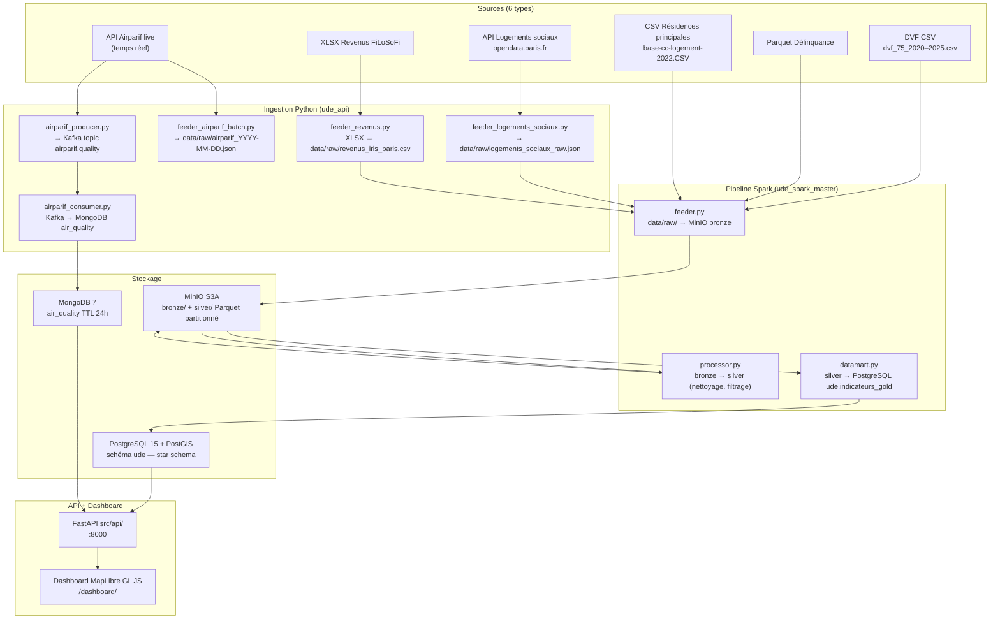

# Architecture — Urban Data Explorer

## Flux de données global

## Services Docker Compose

| Conteneur | Image | Ports exposés | Rôle |
|-----------|-------|---------------|------|
| `ude_postgres` | postgis/postgis:15-3.4 | 5433 | Base relationnelle Gold + star schema |
| `ude_mongodb` | mongo:7.0 | 27017 | Qualité de l'air Airparif (TTL 24h) |
| `ude_zookeeper` | confluentinc/cp-zookeeper:7.6.1 | — | Coordination Kafka |
| `ude_kafka` | confluentinc/cp-kafka:7.6.1 | 29092 | Streaming Airparif |
| `ude_minio` | minio/minio | 9000, 9001 | Data Lake S3-compatible |
| `ude_minio_init` | minio/mc | — | Création des buckets au démarrage |
| `ude_spark_master` | Dockerfile.spark | 8080, 7077 | Orchestration Spark Standalone |
| `ude_spark_worker` | Dockerfile.spark | — | Exécution (2 CPU, 2 Go RAM) |
| `ude_api` | Dockerfile | 8000 | FastAPI + dashboard statique |

## Les 3 jobs Spark

**feeder.py** lit les fichiers locaux (`data/raw/`) et les écrit en Parquet partitionné dans MinIO bronze. Le pont pandas est utilisé pour le fichier XLSX revenus (non supporté nativement par Spark). `cache()` activé pour validation + écriture en un seul scan.

**processor.py** lit la partition bronze du jour, applique les transformations métier (cast types, filtre géographique Paris, calcul `prix_m2`, extraction du numéro d'arrondissement, filtrage des valeurs aberrantes DVF entre 500 et 80 000 €/m²), et écrit en silver. `persist(MEMORY_AND_DISK)` après nettoyage pour réutilisation.

**datamart.py** joint les cinq sources silver, calcule les agrégats par arrondissement × année (`percentile_approx` pour la médiane), et écrit dans PostgreSQL via JDBC (`batchsize=10000`). `cache()` sur chaque source silver. La source `residences_principales` alimente `ude.arrondissements.nb_residences_principales` via JVM bridge (UPDATE direct, hors JDBC Spark).

## Mapping compétences ↔ briques techniques

| Code | Compétence | Brique technique | Techno | Argument pour la soutenance |
|------|-----------|-----------------|--------|------------------------------|
| C1.1 | Base relationnelle | `ude.indicateurs_gold` + tables dim | PostgreSQL 15 + PostGIS | Schéma normalisé, FK, index géospatiaux, alimenté par JDBC Spark |
| C1.2 | Base non relationnelle | Collection `air_quality` TTL 24h | MongoDB 7 | Documents JSON imbriqués, expiration automatique, requêtes par code INSEE |
| C1.3 | Data Lake sécurisé | Buckets `bronze/` + `silver/` partitionnés | MinIO S3-compatible | Pattern Medallion, partitionnement date, API S3A identique à AWS en production |
| C1.4 | Architecture scalable | Spark Standalone + Docker health checks + retry tenacity | Spark 4.1.2, Docker Compose | Workers ajoutables sans modifier le code, auto-retry APIs, déploiement en une commande |
| C2.1 | API interopérable | 7 endpoints métier + auth X-API-Key + OpenAPI | FastAPI + Pydantic v2 | Validation stricte des paramètres, Swagger auto sur `/docs`, CORS configurable |
| C2.2 | Système distribué/streaming | Producer → Kafka → Consumer → MongoDB | Kafka + asyncio + pymongo | 20 appels Airparif async, découplage total, replay depuis le topic, rétention 24h |
| C2.3 | Transformation multi-sources | `processor.py` — 6 sources → silver unifié | PySpark 4.1.2 | CSV + Parquet + XLSX + JSON + API normalisés et joinables sur `arrondissement × annee` |
| C2.4 | Pipelines optimisés | 3 jobs spark-submit + cache/persist + partitionnement | PySpark 4.1.2 | `cache()` visible Spark UI Storage, shuffle partitions=8, aucun chemin codé en dur |

## Sources de données du dashboard

Chaque KPI du dashboard interroge une source différente :

| KPI | Source | Alimenté par |
|-----|--------|--------------|
| Prix médian/m² | PostgreSQL `ude.indicateurs_gold` | Spark datamart.py |
| Logements sociaux | PostgreSQL `ude.indicateurs_gold` + `ude.arrondissements` | Spark datamart.py + feeder résidences principales |
| Revenu médian | PostgreSQL `ude.indicateurs_gold` | Spark datamart.py |
| Densité population | PostgreSQL `ude.arrondissements` | Spark datamart.py |
| Qualité de l'air | **MongoDB** `air_quality` | `airparif_consumer.py` (Kafka) |
| Nombre de délits | PostgreSQL `ude.indicateurs_gold` | Spark datamart.py (`taux_delinquance_global` = SUM faits/an) |

> **Important** : le KPI "Qualité de l'air" dépend du chemin **streaming** (Kafka), pas du pipeline Spark batch. `feeder_airparif_batch.py` écrit dans `data/raw/` comme les autres sources (landing zone commune) — c'est `airparif_producer.py` + `airparif_consumer.py` qui alimentent MongoDB. Si ces deux processus ne tournent pas, le KPI affiche `N/A`.

> **Taux de logements sociaux** : calculé à la volée dans l'API — `SUM(nb_logements_sociaux) / nb_residences_principales × 100`. Le dénominateur `nb_residences_principales` provient de la source INSEE RP 2022 (`base-cc-logement-2022.CSV`), stockée dans `ude.arrondissements` via JVM bridge dans `datamart.py`.

## Optimisations Spark (C2.4)

| Optimisation | Où | Effet dans Spark UI |
|---|---|---|
| `cache()` | feeder.py, datamart.py | Storage tab : DataFrame en cache mémoire |
| `persist(MEMORY_AND_DISK)` | processor.py | Storage tab : spillover disque si RAM insuffisante |
| `spark.sql.shuffle.partitions=8` | Tous les scripts submit/ | Stages tab : 8 partitions au lieu de 200 après groupBy |
| Partitionnement Parquet date | feeder.py + processor.py | Predicate pushdown — lecture de la seule partition cible |
| JDBC `batchsize=10000` | datamart.py | Écriture PostgreSQL groupée |
