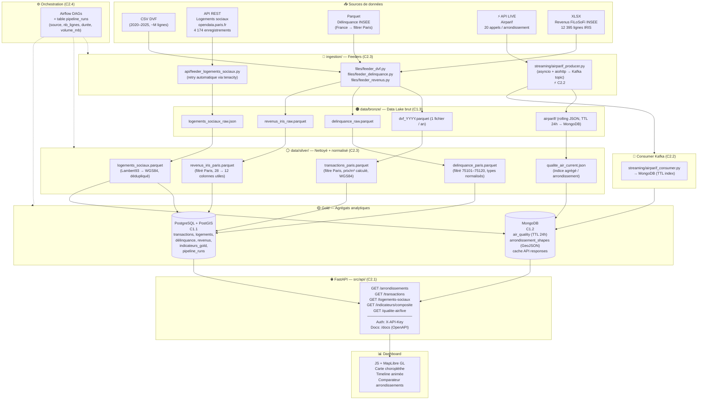

# Architecture — Urban Data Explorer

## Schéma global

---

## Couches Medallion — détail

### Bronze — Données brutes (C1.3)

**Rôle :** Copie fidèle des sources originales, sans aucune transformation. Chaque pipeline peut être rejoué depuis le Bronze.

| Source | Format Bronze | Emplacement |
|--------|--------------|-------------|
| DVF CSV | Parquet (converti par feeder) | `data/bronze/dvf_YYYY.parquet` |
| Logements sociaux API | JSON (réponses brutes) | `data/bronze/logements_sociaux_raw.json` |
| Délinquance Parquet | Parquet (copie brute) | `data/bronze/delinquance_raw.parquet` |
| Airparif API live | JSON rolling | `data/bronze/airparif/YYYY-MM-DD_HH.json` → puis MongoDB |
| Revenus XLSX | Parquet (converti par feeder) | `data/bronze/revenus_iris_raw.parquet` |

**Accès contrôlé :** `data/raw/` est dans `.gitignore` (données DVF non publiques hors OpenData officielle). Bronze et au-delà sont versionnés sans les données (`.gitkeep`). Les données réelles vivent hors dépôt.

### Silver — Nettoyé et normalisé (C2.3)

**Rôle :** Données nettoyées, typées correctement, filtrées sur Paris, géocodées en WGS84.

Transformations clés :
- **DVF :** filtre `code_commune LIKE '75%'`, calcul `prix_m2 = valeur_fonciere / surface_reelle_bati`, parsing date, suppression doublons
- **Logements sociaux :** reprojection Lambert93 → WGS84 (`pyproj`), standardisation `arrdt` en int (1–20)
- **Délinquance :** filtre `CODGEO_2025 IN ('75101'...'75120')`, extraction `arrondissement = int(code[3:])`
- **Revenus :** filtre `COM LIKE '751%'`, sélection 12 colonnes utiles sur 28, renommage
- **Airparif :** agrégation des 20 réponses → 1 document JSON par run

### Gold — Agrégats analytiques

**Rôle :** Données prêtes pour l'API et le dashboard, agrégées à la maille arrondissement × période.

Deux destinations complémentaires :

**PostgreSQL (C1.1)** — données relationnelles normalisées, requêtes analytiques, joins géospatiaux via PostGIS.

**MongoDB (C1.2)** — deux cas d'usage distincts :
1. Cache qualité de l'air avec index TTL 24h (les données Airparif expirent automatiquement)
2. GeoJSON des polygones d'arrondissements (index `2dsphere` pour les requêtes spatiales du dashboard)

---

## Choix techniques justifiés

### PostgreSQL vs MySQL

PostgreSQL est choisi pour **PostGIS** (requêtes géospatiales — `ST_Within`, `ST_Distance`, `ST_Intersects`) indispensables pour agréger les transactions DVF par polygone d'arrondissement. MySQL n'a pas d'équivalent PostGIS aussi mature. PostgreSQL supporte aussi nativement `JSONB` et les window functions (`ROW_NUMBER`, `LAG`, `PERCENT_RANK`) utiles pour les calculs de déciles de prix.

### MongoDB vs Redis

Redis est un cache clé-valeur simple, idéal pour des strings ou des hashes mais sans support des requêtes géospatiales ni des documents imbriqués. MongoDB offre :
- Index `2dsphere` pour les requêtes géospatiales (polygones d'arrondissements)
- Index TTL pour l'expiration automatique des données Airparif (24h)
- Stockage natif des structures GeoJSON Feature complexes

Redis aurait pu couvrir le cache des réponses API mais pas les GeoJSON ni les requêtes spatiales.

### Kafka vs RabbitMQ vs simple polling

Pour le composant C2.2 (distribué/streaming), trois options ont été évaluées :

| Option | Avantages | Inconvénients |
|--------|-----------|---------------|
| Simple polling direct | Très simple, 0 infra | Pas de découplage, pas de replay |
| RabbitMQ | Léger, facile à configurer | Efface les messages après consommation |
| **Kafka** | **Log append-only, replay, découplage total** | Plus lourd à démarrer |

Kafka est retenu parce que le log Kafka permet de **rejouer** les données de qualité d'air et de construire un historique a posteriori. Le découplage producer/consumer permet aussi d'ajouter des consumers (ex. alerte si indice > seuil) sans modifier le producer.

### FastAPI vs Flask vs Django REST

FastAPI génère automatiquement OpenAPI/Swagger, supporte async nativement (compatible avec les appels MongoDB/PostgreSQL async), et valide les paramètres via Pydantic. Flask nécessiterait des librairies supplémentaires (marshmallow, flasgger). Django REST est surdimensionné pour un projet académique.

### Airflow vs Prefect vs cron

Airflow est choisi pour la visibilité (UI de monitoring des DAGs) et la richesse des opérateurs. Prefect serait plus simple à installer mais moins standard dans les environnements professionnels. Le cron suffirait techniquement mais ne démontre pas C2.4 (mesure de perf, retry, orchestration formalisée).

---

## Scalabilité et résilience (C1.4)

**Conteneurisation :** chaque service (PostgreSQL, MongoDB, Kafka, API) tourne dans son propre conteneur Docker. Reproductible sur n'importe quelle machine du groupe avec `docker-compose up -d`.

**Retry automatique :** les feeders API (logements sociaux, Airparif) utilisent `tenacity` avec `retry(stop=stop_after_attempt(3), wait=wait_exponential(min=1, max=10))`. En cas d'indisponibilité de l'API source, le pipeline réessaie avec backoff exponentiel.

**Health checks :** chaque service Docker déclare un `healthcheck`. Le service `api` attend que PostgreSQL et MongoDB soient `healthy` avant de démarrer (`depends_on: condition: service_healthy`).

**Découplage Kafka :** si l'API Airparif est lente, le producer ne bloque pas l'API web — les données sont en queue dans Kafka.

**Monitoring :** la table `pipeline_runs` (PostgreSQL) loggue pour chaque run : source, nb_lignes, durée_secondes, volume_mb, statut. Permet de détecter des dérives de performance au fil du temps.

---

## Mapping compétences ↔ briques (synthèse soutenance)

| Code | Brique | Techno | Argument (1 phrase) |
|------|--------|--------|---------------------|
| C1.1 | Tables `transactions_dvf`, `arrondissements`, `logements_sociaux`, `delinquance`, `revenus_iris`, `indicateurs_gold` | PostgreSQL 15 + PostGIS | Schéma normalisé avec FK et index géospatiaux PostGIS pour agréger les transactions par polygone d'arrondissement |
| C1.2 | Collections `air_quality` (TTL 24h) + `arrondissement_shapes` (GeoJSON, index 2dsphere) | MongoDB 7 | Documents JSON hétérogènes avec expiration automatique et requêtes géospatiales natives |
| C1.3 | Zones `data/bronze/` → `silver/` → `gold/`, `.gitignore` sur données sensibles | Filesystem + convention Medallion | Données immutables par couche, audit trail complet, accès contrôlé par zone |
| C1.4 | Docker Compose, `tenacity` retry, health checks, découplage Kafka, table `pipeline_runs` | Docker, tenacity, Kafka | Déployable en une commande, auto-retry sur les sources API, monitoring de performance intégré |
| C2.1 | `src/api/main.py` avec auth `X-API-Key`, validation Pydantic, `/docs` Swagger auto | FastAPI 0.111 + Pydantic v2 | API sécurisée par clé, contrat OpenAPI auto-documenté, validation stricte des paramètres d'entrée |
| C2.2 | `ingestion/streaming/airparif_producer.py` → topic Kafka → `airparif_consumer.py` → MongoDB | Kafka 7.6, asyncio, aiohttp | 20 appels Airparif produits en async toutes les heures, découplés du consumer MongoDB par le log Kafka |
| C2.3 | `pipelines/silver/` — join 5 sources sur `arrondissement`, reprojection géo, calcul prix/m² | Pandas 2.2, GeoPandas, pyproj | Fusion de 5 formats hétérogènes (CSV/JSON/Parquet/XLSX/API) sur clé commune avec normalisation géographique |
| C2.4 | DAGs Airflow (1 par source + 1 global), table `pipeline_runs`, décorateur `@log_pipeline_run` | Airflow 2.9, PostgreSQL | Chaque run loggue source / nb_lignes / durée / volume_mb → tableau de bord de performance mesurable à la soutenance |

---

## Plan de mise en œuvre

### Phase 1 — Socle (semaines 1–2)
- Docker Compose opérationnel (PostgreSQL + MongoDB + Kafka)
- DDL PostgreSQL complet (`sql/ddl/`)
- Feeders DVF et logements sociaux fonctionnels
- Pipeline Silver DVF basique (filtre Paris + prix/m²)
- FastAPI avec 1 endpoint `/arrondissements`

### Phase 2 — Pipeline complet (semaines 3–4)
- Silver pour toutes les sources (délinquance, revenus, logements)
- Gold → tables PostgreSQL alimentées
- Poller Airparif → Kafka → MongoDB
- API avec tous les endpoints
- Airflow DAGs (batch + stream)

### Phase 3 — Dashboard + finalisation (semaines 5–6)
- Dashboard MapLibre GL (choroplèthe + timeline)
- Métriques `pipeline_runs` visibles
- Tests d'intégration
- Documentation OpenAPI complète
- Préparation soutenance

---

## Dossiers à ajouter progressivement

Les dossiers suivants ne sont **pas créés au démarrage** — ils seront ajoutés à mesure que le projet avance :

| Dossier | Quand l'ajouter |
|---------|----------------|
| `tests/` | Phase 2 — quand il y a du code à tester |
| `notebooks/exploration/` | Phase 1 — optionnel, si l'équipe veut explorer les données |
| `transformations/` | Phase 2 — si les transformations Silver deviennent complexes |
| `metadata/` | Phase 3 — data catalog et lineage |
| `reports/` | Phase 3 — rapports de qualité |
| `infrastructure/terraform/` | Hors scope académique (déploiement cloud) |
| `ci/` | Phase 3 — CI/CD GitHub Actions |
| `deployment/staging/` | Phase 3 |
